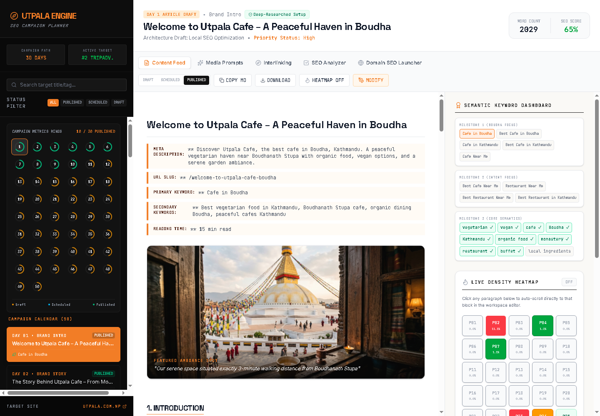

# Utpala Cafe SEO Blog Engine

Utpala Cafe SEO Blog Engine is a React and Express content workspace for planning, editing, auditing, and publishing a 30-day SEO blog campaign for Utpala Cafe in Boudha, Kathmandu.



## Features

- 30-day article calendar with status tracking
- SEO article editor with metadata, keyword, and readability checks
- Local citation copy generator for directory listings
- Subdomain SEO guidance for `blog.utpala.com.np`
- Server-side AI article generation through a neutral API key configuration
- Production build for Node.js/cPanel deployment

## Tech Stack

- React 19
- TypeScript
- Vite
- Express
- Tailwind CSS
- Motion
- Lucide React

## Installation

Clone the repository and install dependencies:

```bash
git clone https://github.com/thapaprogress/utpala_seo_blog.git
cd utpala_seo_blog
npm install
```

Create an environment file:

```bash
cp .env.example .env
```

Add your values:

```env
AI_API_KEY="your_api_key_here"
AI_MODELS=""
APP_URL="http://localhost:3000"
```

`AI_API_KEY` is required only for AI-powered article generation and AI-assisted citation/readability actions. The app still includes local fallback logic for some tools.

## Local Development

Start the full-stack development server:

```bash
npm run dev
```

Open:

```text
http://localhost:3000
```

## Production Build

Build the frontend and server bundle:

```bash
npm run build
```

Start the production server:

```bash
npm start
```

The production server runs from:

```text
dist/server.cjs
```

## cPanel Deployment

For cPanel Node.js App deployment:

1. Upload the project files to the application root, for example `blog.utpala.com.np`.
2. In cPanel Node.js App, set the application root to that folder.
3. Set the startup file:

```text
dist/server.cjs
```

4. Add environment variables:

```env
NODE_ENV=production
AI_API_KEY=your_api_key_here
APP_URL=https://blog.utpala.com.np
```

5. Run `npm install` from cPanel.
6. Run `npm run build` locally before upload, or build on the server if your cPanel account supports it.
7. Start or restart the Node.js app.

For static-only hosting, upload the contents of `dist` to the domain root. Static hosting will load the dashboard, but server-side AI/API features require the Node.js app.

## Useful Scripts

```bash
npm run dev      # Start local full-stack development server
npm run build    # Build frontend and server bundle
npm start        # Run production server
npm run lint     # Type-check the project
```

## Project Structure

```text
src/
  App.tsx
  data/
  assets/
server.ts
vite.config.ts
metadata.json
.env.example
```

## Notes

- Do not commit `.env`; use `.env.example` as the public template.
- Keep `src/assets/images` available in deployments because article cards reference those image files.
- The production server serves both the React app and `/api/*` endpoints from the same Node.js process.
